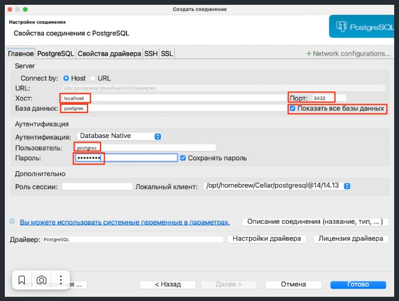

# Базы данных

## PostgreSQL

Установка PostgreSQL

Windows: https://selectel.ru/blog/tutorials/ustanovka-postgresql-15-windows/  
Ubuntu: https://firstvds.ru/technology/ustanovka-postgresql-na-ubuntu  
MacOS: https://ploshadka.net/ustanovka-i-podkljuchenie-postgresql-na-mac-os/ или  
```
brew install postgresql
createuser -s postgres
brew services restart postgresql
```

**Установка DBeaver**
Windows: https://practicum.yandex.ru/blog/menedzher-baz-dannyh-dbeaver/  
Ubuntu: https://losst.pro/ustanovka-dbeaver-v-ubuntu-22-04  
MacOS: https://dbeaver.io/download/ (скачайте и запустите)  

**Подключение к базе данных PostgreSQL в DBeaver**


)


Подключение из консоли:
> sudo -u postgres psql

Посмотреть всех пользователей:
> \du

Список баз данных:
> \l

Создать нового пользователя:
> CREATE USER <username> WITH PASSWORD '<password>';

Создать новую базу данных:
> CREATE DATABASE <database_name>;

Дать права на базу данных:
> GRANT ALL PRIVILEGES ON DATABASE <database_name> TO <username>;

Если нужно, чтобы пользователь стал владельцем базы данных:
> ALTER DATABASE <database_name> OWNER TO <username>;

Подключиться к базе данных под новым пользователем
Выйдите из psql:
> \q

Подключитесь под новым пользователем:
> psql -h <host> -U <username> -d <database_name>


***[sqlalchemy and alembic ...](sqlalchemy_and_alembic.md)***


