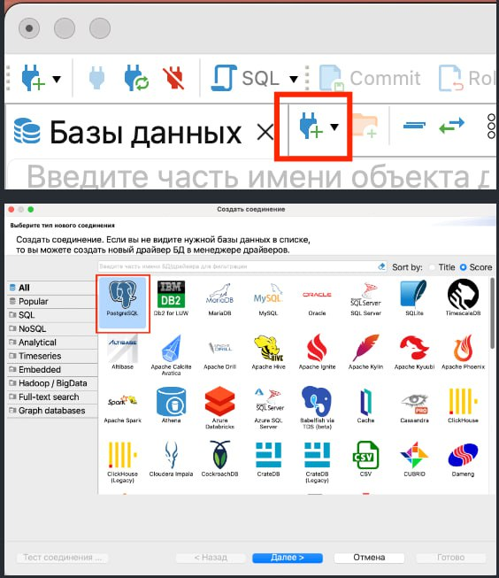
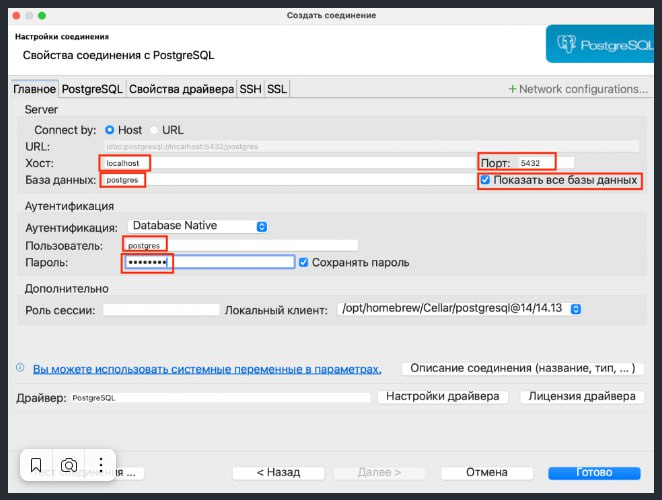

# Базы данных

## PostgreSQL

Установка PostgreSQL

Windows: https://selectel.ru/blog/tutorials/ustanovka-postgresql-15-windows/  
Ubuntu: https://firstvds.ru/technology/ustanovka-postgresql-na-ubuntu  
MacOS: https://ploshadka.net/ustanovka-i-podkljuchenie-postgresql-na-mac-os/ или  
```
brew install postgresql
createuser -s postgres
brew services restart postgresql
```

**Установка DBeaver**
Windows: https://practicum.yandex.ru/blog/menedzher-baz-dannyh-dbeaver/  
Ubuntu: https://losst.pro/ustanovka-dbeaver-v-ubuntu-22-04  
MacOS: https://dbeaver.io/download/ (скачайте и запустите)  

**Подключение к базе данных PostgreSQL в DBeaver**


)


